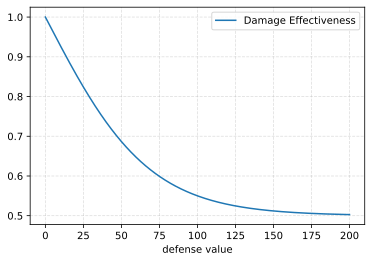

# Combat
## (De)Buffs
All non-instantaneous effects on a player are represented as Buffs (beneficial) or Debuffs (harmful).

### Crowd Control (CC)
* _Movement_
  * **Root**: No movement
  * **Snare**: Reduced movement speed
* _Casting_
  * **Silence**: No casting
  * **Slow**: Reduced cast speed
* **Stun**: No movement and no casting (ie, Root+Silence)
* **Blind**: Decreased vision
* **Disorient**: Reverses movement direction (ie, `A` goes left, `W` goes backwards)


## Effectiveness
Effectiveness is applied to all offensive abilities against their targets' defensive stats. It applies not only to damage, but _also debuff duration_.

This means that for example a Physical ability which stuns a target for 2 seconds, may instead last only 1.7 seconds against a target with exceptionally high Armor.

### Calculation
| Defense            | Physical (P) | Energy (E) | Psionic (S) |
|--------------------|:------------:|:----------:|:-----------:|
| **Armor (A)**      | 100%         | 25%        | 50%         |
| **Resistance (R)** | 50%          | 100%       | 25%         |
| **Will (W)**       | 25%          | 50%        | 100%        |

If `f` is the function for damage effectiveness %, then the we define the effective damage calculation as:
- **Physical** `= dmg * f(A + R/2 + W/4)`
- **Energy** `= dmg * f(A/4 + R + W/2)`
- **Psionic** `= dmg * f(A/2 + R/4 + W)`

```
f(def) = -0.5 * tanh(0.0147 * def) + 1
```


#### Example1
`armor=10, resistance=40, will=20`

(see [damage_calcs](./damage_calcs.ipynb))

Damage effectiveness can be pre-calculated:

||vs Physical|vs Energy|vs Psionic|
|---|---|---|---|
|**Value**|40.5|54.75|39.5|
|**Damage Effectiveness**|73.3%|66.6%|73.8%|

**Damage profile (120 total)** shows the amount of damage taken for an ability with its damage evenly split between the types specified in the "Raw" column (eg, "Physical/Energy" means 60 Physical damage + 60 Energy damage). The Dmg Eff % gives the composite effectiveness (total taken / total raw).
|Raw Type|Damage Taken|Net Damage Effectiveness|
|---|---|---|
|**Single**|
|Physical|88|73.3%|
|Energy|80|66.6%|
|Psionic|89|73.8%|
|**Dual-Hybrid**|
|Physical/Energy|84|70.0%|
|Physical/Psionic|88|73.5%|
|Psionic/Energy|84|70.2%|
|**Tri-Hybrid**|
|Physical/Energy/Psionic|85|71.2%|
</details>

### Function Derivation

<details>
<summary>Calculations</summary>

We set 0 defenses to be 100% effectiveness, thus:
```
f(0) = 1
```

Cap reduction to 50%:
```
lim(x->inf, f(x)) = 0.5
```

Let's set 100 defenses to close to the cap, 55%:
```
f(100) = 0.55
```

Also, let's apply some function that gives both diminishing returns and an asymptote:
```
f(def) = A * tanh(B * def) + C
```

Solve for variables given our constraints:
```
f(0) = A * tanh(0) + C
     = 0 + C
=> C = 1

lim(x->inf, f(x) = A * tanh(B * x) + 1) = 0.5
=>     A * lim(x->inf, tanh(B * x)) + 1 = 0.5
=>                                A + 1 = 0.5
=>                                    A = -0.5

f(100)   = -0.5 * tanh(B * 100) + 1
=> -0.45 = -0.5 * tanh(B * 100)
=>  0.45 = 0.5 * tanh(B * 100)
=>  0.9  = tanh(B * 100)
=>     B = arctanh(0.9)/100
=>     B ≈ 0.0147
```
</details>

